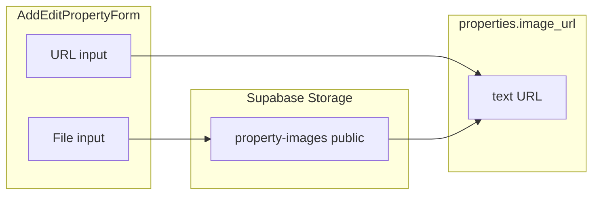

# TenantLens

B2B SaaS for real estate agencies to review and compare rental applicants.

## Scripts

- `npm run dev` — Next.js dev server
- `npm run build` / `npm run start` — production build and server
- `npm test` — Vitest (unit tests, including scoring logic)
- `npm run test:e2e:install` — download Playwright’s Chromium into `node_modules` (run once per machine / after `@playwright/test` upgrades).
- `npm run test:e2e` — Playwright smoke tests (build + `next start` unless `PLAYWRIGHT_BASE_URL` points at an already-running app).

Copy `.env.example` to `.env.local` and add Supabase keys before using `src/lib/supabase/*`.

## Deploy

See [docs/vercel.md](docs/vercel.md) for Vercel environment variables and Supabase checklist.

## Property cover image (upload or URL)

**Goal:** On add and edit property, support either pasting an image URL or uploading a file, storing a stable HTTPS URL in the existing `image_url` column (no DB schema change).

**Status:** Implemented in [src/components/PropertyFormFields.tsx](src/components/PropertyFormFields.tsx), [src/lib/supabase/property-cover-upload.ts](src/lib/supabase/property-cover-upload.ts), and the dialogs. Run the Storage migration [supabase/migrations/20260418140000_property_images_bucket.sql](supabase/migrations/20260418140000_property_images_bucket.sql) on Supabase before uploads work in deployed environments.

### Context

- Cover art is stored as a single string `image_url` on `properties` (see [supabase/migrations/20260418120000_tenantlens_core.sql](supabase/migrations/20260418120000_tenantlens_core.sql)), mapped to `imageUrl` in [src/lib/db/mappers.ts](src/lib/db/mappers.ts).
- UI uses a normal `` ([src/components/PropertyCard.tsx](src/components/PropertyCard.tsx), [src/components/pages/property-detail-page.tsx](src/components/pages/property-detail-page.tsx)), so the stored value must be a **stable HTTPS URL** readable without auth cookies.
- The existing bucket `applicant-documents` is **private** and used with signed URLs in [src/components/ApplicantDrawer.tsx](src/components/ApplicantDrawer.tsx). That pattern is **not** suitable as the long-lived `image_url` for listing photos unless you add a proxy or refresh logic.

### Recommended approach

Introduce a **second** Storage bucket, **public**, dedicated to property cover images (e.g. `property-images`). After upload, persist **`getPublicUrl()`** in `image_url`, same as for external URLs.

### What was built

1. **Migration:** public bucket `property-images` plus `storage.objects` policies (public read, authenticated insert/delete under own `user_id/` prefix).
2. **Client:** `uploadPropertyCoverImage` in [src/lib/supabase/property-cover-upload.ts](src/lib/supabase/property-cover-upload.ts) — `image/*`, 5 MB max, add path `{userId}/{uuid}/…`, edit path `{userId}/{propertyId}/…`.
3. **UI:** URL field, **Upload image** control, preview thumbnail, submit disabled while uploading; edit flow passes `property.id` for storage paths.
4. **Docs:** [docs/vercel.md](docs/vercel.md) mentions `property-images`.

### Optional follow-ups

---

## PDF processing module

TenantLens includes a standalone PDF processing module for extracting and classifying text from applicant-uploaded PDFs. This module is implemented under [src/lib/pdf/](src/lib/pdf/) and is server-only (Node.js/Route Handlers/Server Actions).

**Phases:**
1. **Module + dependency:** Extract text, classify document type, parse simple fields (see [docs/plans/standalone-pdf-module.md](docs/plans/standalone-pdf-module.md)).
2. **Storage integration:** Download PDF bytes from Supabase Storage and process.
3. **Persistence:** Write results/metadata to `applicant_documents`.
4. **Scoring:** Feed structured signals into the scoring system.

See [docs/plans/standalone-pdf-module.md](docs/plans/standalone-pdf-module.md) for full details.

- Add Supabase storage host to [next.config.mjs](next.config.mjs) `images.remotePatterns` if hero/cards switch to `next/image`.
- Orphan cleanup when replacing uploaded covers (delete prior object if URL is on-project storage).

### Testing

- Add property: upload image → save → card and detail show it; `image_url` is a `.../storage/v1/object/public/property-images/...` URL.
- Edit property: replace with upload and with external URL.
- Open the image URL in a fresh browser session (public read).
