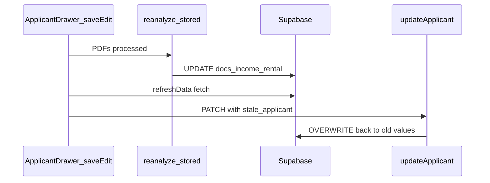

# Applicant edit: PDF scoring + income UX + file picker

## Root cause (why completeness / income / rental history do not move on edit)

In [`src/components/ApplicantDrawer.tsx`](src/components/ApplicantDrawer.tsx), `saveEdit` does the right PDF pipeline (analyze → [`uploadIntakePdfsBestEffort`](src/lib/applicant-intake-storage.ts) → [`POST /api/applicant-pdfs/reanalyze-stored`](src/app/api/applicant-pdfs/reanalyze-stored/route.ts) → `refreshData()`), **then** always calls `updateApplicant` with values derived from the **pre-upload** `applicant` prop and the **form** `weeklyIncome`:

```165:181:src/components/ApplicantDrawer.tsx
      await updateApplicant(applicant.id, {
        name: name.trim(),
        email: email.trim(),
        phone: phone.trim(),
        occupation: occupation.trim(),
        weeklyIncome: Number(weeklyIncome) || 0,
        submittedDocuments: applicant.submittedDocuments,
        rentalHistory: {
          yearsRenting: applicant.rentalHistory.yearsRenting,
          onTimePaymentsPct: applicant.rentalHistory.onTimePaymentsPct,
          referenceQuality: applicant.rentalHistory.referenceQuality,
          notes: historyNotes.trim() || undefined,
          monthsRenting: applicant.rentalHistory.monthsRenting,
          recommendationSentiment: applicant.rentalHistory.recommendationSentiment,
        },
        notes: agentNotes.trim() || undefined,
      });
```

[`reanalyze-stored`](src/app/api/applicant-pdfs/reanalyze-stored/route.ts) already persists `submitted_documents`, `weekly_income`, and merged `rental_history` (lines 177–187 in that route). The follow-up `updateApplicant` issues a full row patch via [`applicantToUpdateRow`](src/lib/db/mappers.ts) and **reverts** those columns to stale data—so document completeness, income vs rent, and rental history appear unchanged.

`refreshData()` in [`src/lib/store.tsx`](src/lib/store.tsx) updates React state but does **not** return the fetched rows, so `saveEdit` cannot see the fresh applicant in the same async function without an API change or an extra fetch.



---

## Phase 0 — Repo plan document (your requested markdown)

Create a new file at the project root, e.g. [`applicant-edit-pdf-and-ui-plan.md`](applicant-edit-pdf-and-ui-plan.md), containing: problem summary, root cause, phased work below, acceptance checks (edit + payslip → completeness + income score; edit + rental/reference PDF → rental fields), and file touch list. This is the durable spec you asked for; keep it updated if scope shifts.

---

## Phase 1 — Correct edit save so PDFs actually stick (functional fix)

**Goal:** After a successful PDF branch in `saveEdit`, the final DB state must match `reanalyze-stored` plus intentional user edits (name, contact, notes, history notes).

**Recommended approach (minimal, localized):**

1. **Return fresh applicants from `refreshData`** in [`src/lib/store.tsx`](src/lib/store.tsx): after the `applicants` query, `setApplicants(...)`, return the mapped `Applicant[]` (or `void` when early-exit). Type the context as `Promise<Applicant[] | void>` or always `Promise<Applicant[]>` with `[]` on empty paths—pick one and update `DataStore` typing.

2. **In `saveEdit`**, capture `const hadPdfUpload = selectedPdfFiles.length > 0` at the start of the PDF block (before clearing selection). After `await refreshData()`, resolve `const latest = refreshed?.find((a) => a.id === applicant.id) ?? applicant`.

3. **Build the `updateApplicant` payload:**
   - **If `hadPdfUpload`:** set `submittedDocuments`, `weeklyIncome`, and `rentalHistory` from `latest` (PDF-backed truth), then merge **only** user-controlled overrides from the form: e.g. `rentalHistory: { ...latest.rentalHistory, notes: historyNotes.trim() || undefined }` (and same pattern if other note fields must stay manual).
   - **If not:** keep current behavior but drive `weeklyIncome` from `applicant` once Phase 2 removes the input (see below).

4. **Optional cleanup:** [`uploadAndAnalyzePdfs`](src/components/ApplicantDrawer.tsx) is currently unused (only defined). Either wire it to a button or remove it in the same PR if you want less dead code—low priority, only if touched anyway.

**Regression check:** Save edit with PDFs → Supabase row shows new `submitted_documents` / income / rental; UI score ring updates after drawer refresh.

---

## Phase 2 — Weekly income from PDFs only (no manual entry on edit)

**Goal:** Align edit UX with add flow ([`AddApplicantDialog`](src/components/AddApplicantDialog.tsx) already derives income from analyzed PDFs and does not expose a weekly income field).

**Changes in [`ApplicantDrawer`](src/components/ApplicantDrawer.tsx) edit mode:**

- Remove the "Weekly income ($)" `<Input type="number" />` and the `weeklyIncome` state used for editing (keep syncing from `applicant.weeklyIncome` for **display** only, e.g. formatted read-only line: "Weekly income (from documents): …" or "Not detected — upload a payslip").

- **Validation:** Drop `!weeklyIncome.trim()` from `saveEdit`; name + email remain required (match product rules).

- **Save payload:** Always persist `weeklyIncome` from `latest` (after Phase 1 when PDFs ran) or `applicant.weeklyIncome` when no PDF upload—never from a free-text field.

- **Optional product nuance:** If you need a rare manual override later, add an explicit "Override income" advanced toggle; out of scope unless you ask for it.

---

## Phase 3 — Match Add applicant PDF control styling

**Goal:** Replicate the Add applicant pattern ([`AddApplicantDialog.tsx`](src/components/AddApplicantDialog.tsx) ~192–228: `sr-only` file input, styled `<label>`, bordered container, filename chips).

**Implementation options (pick one in implementation):**

- **Preferred:** Extract a small shared component (e.g. `PdfIntakeFilePicker`) used by both Add and Edit to prevent future drift.

- **Minimal:** Copy the same JSX/classes into the edit section of [`ApplicantDrawer.tsx`](src/components/ApplicantDrawer.tsx) (lines ~529–537 currently use raw `<Input type="file" />`).

Use `useId()` for the input id like Add applicant.

---

## Phase ordering and dependencies

| Phase | Depends on | Outcome |
|-------|------------|---------|
| 0 | — | Root `.md` spec file |
| 1 | 0 (doc can reference work) | PDFs on edit update scoring |
| 2 | 1 (uses `latest` / `applicant` for income) | No misleading manual income |
| 3 | Independent of 1–2 | UI parity |

Phases 1–2 are tightly coupled; Phase 3 can ship in parallel or immediately after.

---

## Files likely touched

- [`src/components/ApplicantDrawer.tsx`](src/components/ApplicantDrawer.tsx) — `saveEdit`, validation, weekly income UI, file picker markup.
- [`src/lib/store.tsx`](src/lib/store.tsx) — `refreshData` return value + `DataStore` type.
- Any call sites of `refreshData()` — ensure they still `await` correctly if return type changes (grep `refreshData`).
- Optional new file: `src/components/pdf-intake-file-picker.tsx` (or similar) if extracting Phase 3.
- New root doc: `applicant-edit-pdf-and-ui-plan.md` (Phase 0).
