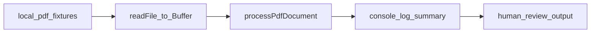

# PDF module — real-PDF verification

**Goal:** Run the standalone PDF pipeline against **real PDF files** (local disk and optionally Supabase Storage), print **`ExtractedPdfResult`** in a form you can read in the terminal, and judge whether classification and field heuristics behave as expected—without committing sensitive PDFs or keys.

**Related:** Phase 1 design and roadmap live in [`standalone-pdf-module.md`](standalone-pdf-module.md). Core code: [`src/lib/pdf/`](../../src/lib/pdf/).

---

## What you are verifying

The orchestrator [`processPdfDocument`](../../src/lib/pdf/process-pdf-document.ts) returns [`ExtractedPdfResult`](../../src/lib/pdf/types.ts):

| Field | Meaning |
|--------|--------|
| `fileName` | Name passed in (used by the classifier) |
| `documentType` | Output of [`classifyDocument`](../../src/lib/pdf/classify-document.ts) (keyword / filename rules) |
| `rawText` | Text from `pdf-parse` (text-layer PDFs only; no OCR) |
| `parsedFields` | Output of [`parseDocumentFields`](../../src/lib/pdf/parse-document-fields.ts) (naive first-number and phrase heuristics) |
| `extractedAt` | ISO timestamp when processing ran |

**“Correct” today** means: types and text extraction look reasonable for *your* samples given the **intentionally simple** rules. Wrong `income`, wrong `documentType`, or empty `rawText` on **scanned** PDFs is expected until you add richer parsing or OCR.

---

## Path and repo conventions

- Implementation stays under [`src/lib/pdf/`](../../src/lib/pdf/) with imports `@/lib/pdf/...`.
- **Do not** commit real applicant PDFs. Use a **gitignored** directory for local fixtures (see below).
- Tests use **Vitest** ([`package.json`](../../package.json) script `npm test`). Default config uses **`jsdom`** ([`vitest.config.ts`](../../vitest.config.ts)); any test that calls `pdf-parse` and `Buffer` must run in the **Node** environment (file pragma or `environmentMatchGlobs`).

---

## Phase A — Local PDF fixtures (primary)

### Layout

1. Choose a fixture directory, e.g. `local-pdf-fixtures/` at the repo root.
2. Add that path to [`.gitignore`](../../.gitignore) so nothing under it is ever committed.
3. Drop 2–5 PDFs (anonymized or synthetic), for example:
   - A payslip-style file (name or body mentions payslip).
   - A bank statement.
   - A rental / tenancy letter.
   - An ID-style PDF (filename hints help the classifier).
   - One **image-only / scanned** PDF to confirm empty or useless `rawText`.

### Integration test (recommended implementation)

Add a Vitest file under `src/lib/pdf/`, e.g. `process-pdf-document.integration.test.ts`:

- Guard with `describe.skipIf(!process.env.REAL_PDF_FIXTURE_DIR)` (or require `RUN_REAL_PDF_TESTS=1` plus a path).
- Read `*.pdf` from `REAL_PDF_FIXTURE_DIR` with `fs`, `Buffer.from`, then `await processPdfDocument(fileName, buffer)`.
- For each file, **`console.log`** a readable summary: `fileName`, `documentType`, `parsedFields`, **`rawText.length`**, and **`rawText` truncated** (e.g. first 800 characters) so the terminal stays usable.
- **Assertions:** only structural sanity (object shape, `typeof rawText === 'string'`). Optionally `expect(rawText.length).toBeGreaterThan(0)` for files you know are text-based; skip or soften for known scans.

**Run:**

```bash
REAL_PDF_FIXTURE_DIR=./local-pdf-fixtures npm test -- src/lib/pdf/process-pdf-document.integration.test.ts
```

Adjust the path after `--` to match the filename you add.

### Node environment

Either:

- Put `// @vitest-environment node` at the top of the integration test file, **or**
- In [`vitest.config.ts`](../../vitest.config.ts), set `environmentMatchGlobs` so `src/lib/pdf/**/*.integration.test.ts` uses `node`.

---

## Phase B — Supabase Storage fetch (optional)

If you want to verify the same pipeline after **downloading** bytes from Storage ([`processPdfFromStorage`](../../src/lib/pdf/process-pdf-from-storage.ts) → [`downloadPdfFromStorage`](../../src/lib/pdf/download-pdf-from-storage.ts)):

- Add a second `describe` or `it` **skipped** unless env vars are set, e.g. `REAL_PDF_STORAGE_BUCKET`, `REAL_PDF_STORAGE_PATH`, plus working Supabase server env from [`.env.local`](../../.env.local) / [`.env.example`](../../.env.example).
- Never commit bucket names, paths, or keys; document the variable names only in this plan.

---

## Human checklist after a run

1. For each PDF, does **`documentType`** match what the file actually is, given the keywords in [`classify-document.ts`](../../src/lib/pdf/classify-document.ts)?
2. Does **`parsedFields.income`** look like a real net/gross pay line, or is it the first random number on the page (common with the current regex)?
3. Does **`rawText`** look like real extracted text (confirms a text layer vs scan)?

Use findings to decide: tweak keywords/regex, accept limitations for Phase 1, or plan OCR / richer parsing later.

---

## Verification commands (summary)

| Check | Command |
|--------|--------|
| Build still works | `npm run build` |
| Real PDFs (after test file exists) | `REAL_PDF_FIXTURE_DIR=./local-pdf-fixtures npm test -- <integration-test-file>` |

---

## Diagram (reference)



---

## Non-goals

- No strict “expected income = $X” assertions on arbitrary real PDFs.
- No committing real PII PDFs or storage credentials.
- No product UI required for this verification pass (terminal output is enough).
