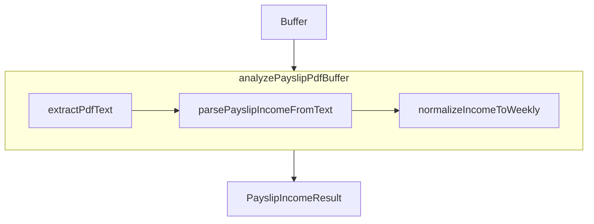

# PDF payslip income module

**Goal:** Ship a **server-only**, reusable module under [`src/lib/pdf/`](../../src/lib/pdf/) that extracts plain text from payslip PDFs (text layer via `pdf-parse` only) and returns **structured income fields**—amount, pay frequency, weekly equivalent, confidence, and notes—using **regex and keyword heuristics** (no OCR, no paid APIs).

**Phase 1 (this document + types):** Canonical spec and [`types.ts`](../../src/lib/pdf/types.ts) lock the public result shape before extract/parse code lands in Phases 2–3.

---

## Out of scope (all phases of this initiative)

- UI, routes, or applicant onboarding changes.
- Wiring into existing manual applicant flows.
- OCR or image-based PDF recovery.
- Paid third-party document APIs.
- Committing real applicant PDFs to git (use gitignored [`local-pdf-fixtures/`](../../local-pdf-fixtures/) locally).

---

## Path and repo conventions

- Code lives under [`src/lib/pdf/`](../../src/lib/pdf/); import via `@/lib/pdf/...`.
- [`tsconfig.json`](../../tsconfig.json) includes `src/**/*.ts` only; the module is **TypeScript** (the legacy [`index.js`](../../src/lib/pdf/index.js) one-off script is removed in **Phase 2**).
- Callers must run PDF helpers **on the server** only (Node `Buffer`, Route Handlers / Server Actions).

---

## Phased roadmap

| Phase | Deliverables |
|-------|----------------|
| **1** | This file + [`types.ts`](../../src/lib/pdf/types.ts) (complete). |
| **2** | [`extract-pdf-text.ts`](../../src/lib/pdf/extract-pdf-text.ts), [`index.ts`](../../src/lib/pdf/index.ts) barrel; remove side-effect `index.js`. |
| **3** | `parse-payslip-income.ts`, weekly normalization, `analyzePayslipPdfBuffer` orchestrator; barrel exports. |
| **4** | Vitest (committed text fixtures + optional Node integration for local PDFs), optional `scripts/run-payslip-income.mjs`. |

---

## Public types (Phase 1)

Defined in [`src/lib/pdf/types.ts`](../../src/lib/pdf/types.ts):

| Export | Meaning |
|--------|---------|
| `PayFrequency` | `weekly` \| `fortnightly` \| `monthly` \| `annual` \| `unknown` |
| `IncomeConfidence` | `high` \| `medium` \| `low` (match clarity; set in Phase 3) |
| `PayslipAmountSource` | Which line won: `gross` \| `net` \| `annual` \| `other` \| `null` |
| `PayslipIncomeCandidate` | `{ source, amount, frequencyHint, lineSnippet? }` |
| `PayslipIncomeParse` | Parse-only: amounts, frequency, source, `candidates[]`, `notes[]` |
| `PayslipIncomeResult` | Parse fields plus `rawText`, `weeklyIncome`, `confidence` |

**Semantics:**

- **`notes`:** Human-readable trace (e.g. “Used GROSS PAY $995.70”, “Inferred weekly from 7-day pay period”).
- **`candidates`:** Bounded (e.g. top 5) for debugging and future UI; not required to match `detectedIncomeAmount` when heuristics collapse to one winner.

---

## Planned public functions (Phases 2–3)

| Function | Phase | Responsibility |
|----------|-------|------------------|
| `extractPdfText(data: Buffer \| Uint8Array): Promise<string>` | 2 | `PDFParse` → `getText()` → trimmed text; `destroy()` in `finally`. |
| `parsePayslipIncomeFromText(rawText: string): PayslipIncomeParse` | 3 | Regex/keyword extraction; no PDF I/O. |
| `normalizeIncomeToWeekly(amount: number, frequency: PayFrequency): number \| null` | 3 | `unknown` → `null`; standard annual÷52, monthly×12÷52, etc. |
| `analyzePayslipPdfBuffer(data: Buffer \| Uint8Array): Promise<PayslipIncomeResult>` | 3 | Extract → parse → normalize → confidence. |

---

## Planned income heuristics (Phase 3)

**Money:** Strip `$`, commas; parse decimals; prefer amount on same line as a label.

**Keyword / label families (case-insensitive):**

| Concept | Examples | Role |
|---------|----------|------|
| Annual | `annual salary`, salary/annual phrases | `annual` amount |
| Gross | `gross pay`, `total gross`, ordinary gross | period gross |
| Net | `net pay`, `take home`, `amount payable` | period net |
| Frequency words | `weekly`, `per week`, `fortnightly`, `monthly` | explicit `PayFrequency` |
| Pay period | `Pay period from … to …` | infer days → weekly / fortnightly / monthly hints |

**Priority for primary `detectedIncomeAmount` (when multiple hits exist):**

1. Gross for the pay period when period length suggests weekly/fortnightly.
2. Else annual salary.
3. Else gross with `unknown` frequency if period not inferred.
4. Else net pay (note in `notes`).
5. Collisions at same tier → deterministic pick + explanatory `notes`.

---

## Data flow (after Phase 3)

---

## Verification (after Phase 4)

- **Always:** `npm test` (unit tests on committed text snippets).
- **Optional local PDFs:** set `RUN_PDF_INCOME_FIXTURE_TESTS=1` (exact env name TBD in Phase 4) and ensure [`local-pdf-fixtures/`](../../local-pdf-fixtures/) contains PDFs; integration tests use `node` environment (see [`vitest.config.ts`](../../vitest.config.ts) `environmentMatchGlobs` when added).

---

## Related plans

- [`standalone-pdf-module.md`](standalone-pdf-module.md) — broader document pipeline (not required for payslip-income-only work).
- [`pdf-module-real-pdf-verification.md`](pdf-module-real-pdf-verification.md) — fixture and Vitest conventions.

The phased execution checklist may also exist as a local Cursor plan file (for example `pdf_payslip_income_module_8eff2f8b.plan.md` under your machine’s Cursor plans directory); it is not required to live inside this git repo.

---

## Non-goals recap

- No client-bundle imports of `pdf-parse`.
- No replacement of manual applicant steps until a later product decision.
- No guarantee of correctness on scanned PDFs (empty or garbage `rawText` is expected).
