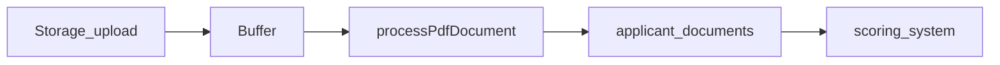

# Standalone PDF processing module

**Goal:** Add an isolated, server-oriented PDF text pipeline under `src/lib/pdf/` using `pdf-parse`, plus a short phased pointer in the root [`README.md`](../../README.md). No UI, database, or applicant-flow changes in Phase 1.

This file is the **canonical plan** for the initiative (copy this structure for other features in [`docs/plans/`](./README.md)).

---

## Path convention (important)

The product spec may say `lib/pdf/`. This repo’s TypeScript include path is **only** [`src/**/*.ts`](../../tsconfig.json) and the alias is `@/*` → `./src/*`.

**Implementation path:** [`src/lib/pdf/`](../../src/lib/pdf/) so everything compiles and imports as `@/lib/pdf/...`.

No changes to [`src/lib/scoring.ts`](../../src/lib/scoring.ts), applicant components, or any routes in Phase 1.

---

## Phase 1 — Module + dependency (implement now)

### Install

- Run: `npm install pdf-parse`
- Add `@types/pdf-parse` only if the toolchain reports missing types (many setups work with `skipLibCheck`).

### New files (five modules)

| File | Responsibility |
|------|----------------|
| [`src/lib/pdf/types.ts`](../../src/lib/pdf/types.ts) | `DocumentType` (string union: `payslip`, `bank_statement`, `rental_history`, `id_document`, `unknown`), `ParsedFields` (optional income, pay frequency, rental-history signals), `ExtractedPdfResult` (fileName, documentType, rawText, parsedFields, optional `extractedAt`). |
| [`src/lib/pdf/extract-pdf-text.ts`](../../src/lib/pdf/extract-pdf-text.ts) | `extractPdfText(buffer: Buffer): Promise<string>` — dynamic `import('pdf-parse')`, return trimmed `.text`. Text-based PDFs only (no OCR). |
| [`src/lib/pdf/classify-document.ts`](../../src/lib/pdf/classify-document.ts) | `classifyDocument(fileName: string, text: string): DocumentType` — keyword rules on `fileName + text`, priority order, default `unknown`. |
| [`src/lib/pdf/parse-document-fields.ts`](../../src/lib/pdf/parse-document-fields.ts) | `parseDocumentFields(text: string): ParsedFields` — simple regex/heuristics for salary/pay frequency/rental phrases; stable shape when nothing matches. |
| [`src/lib/pdf/process-pdf-document.ts`](../../src/lib/pdf/process-pdf-document.ts) | `processPdfDocument(fileName: string, buffer: Buffer): Promise<ExtractedPdfResult>` — orchestrate extract → classify → parse. |

Optional: [`src/lib/pdf/index.ts`](../../src/lib/pdf/index.ts) barrel re-exports (only if you want a single public import path).

### Production / Next.js constraints

- **`Buffer` is Node-only** — call only from Route Handlers, Server Actions, or other server code. Document in README; optional later: `server-only` package for a hard guard.
- **Dynamic `import('pdf-parse')`** inside `extract-pdf-text.ts` to avoid pulling the parser into client bundles.
- **Strictness:** [`tsconfig.json`](../../tsconfig.json) may have `strict: false`; still write the new module with explicit unions and minimal `any`.

### Root README

Append a compact **“PDF processing module”** section to [`README.md`](../../README.md) with Phase 1–4 bullets and a link to **this file** for full detail.

---

## Phase 2 — Storage integration (future)

Download PDF bytes from Supabase Storage (signed URL or server-side access), produce a `Buffer`, pass to `processPdfDocument`.

## Phase 3 — Persistence (future)

Write results / metadata to `applicant_documents` (exact columns and retention TBD).

## Phase 4 — Scoring (future)

Feed structured signals into [`src/lib/scoring.ts`](../../src/lib/scoring.ts) without duplicating scoring rules inside the PDF module.

---

## Phase 2–4 flow (reference)

---

## Verification (after implementation)

- `npm run build` — confirms `pdf-parse` resolves under Next’s bundler.
- Optional later: Vitest fixtures for `classifyDocument` / `parseDocumentFields` (not required for Phase 1).
- Real PDFs (human-in-the-loop): see [`pdf-module-real-pdf-verification.md`](pdf-module-real-pdf-verification.md).

---

## Non-goals (Phase 1)

- No applicant UI or upload flow changes.
- No Supabase migrations or new tables.
- No Tailwind work (module is TypeScript-only).
